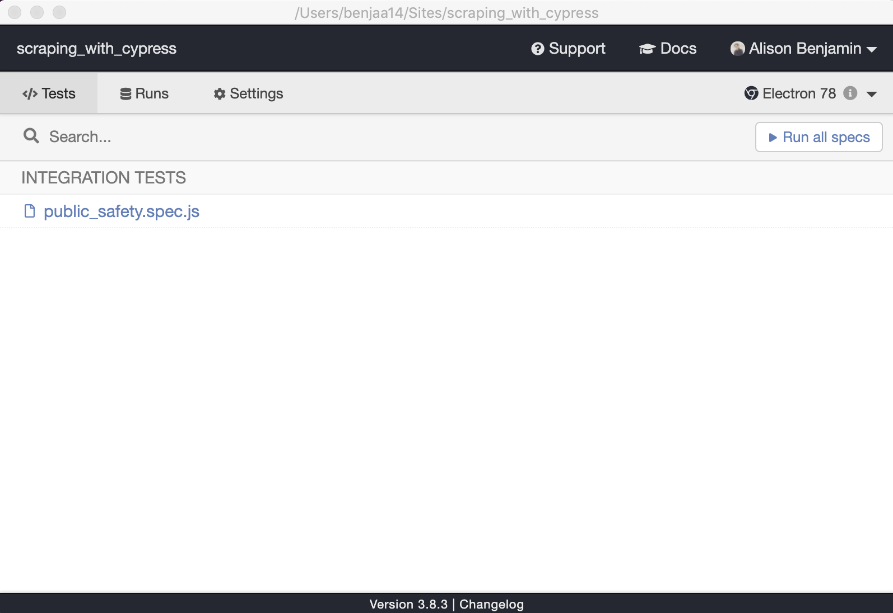
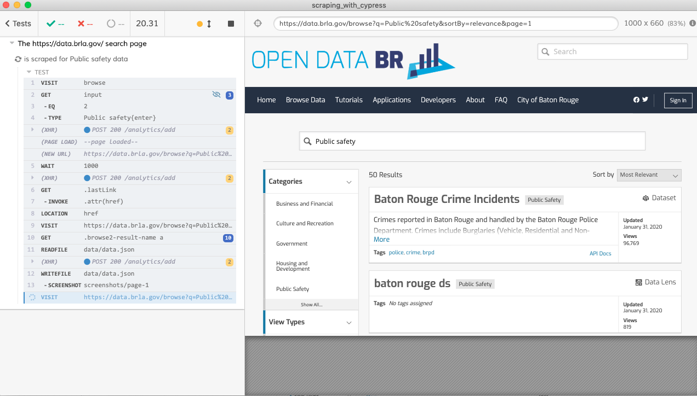

# NICAR2020 - Scraping with Cypress :evergreen_tree:

This scraper browses to [Open Data Baton Rouge](https://data.brla.gov/browse), enters and submits a "public safety" term into its dataset search, handles pagination, takes screenshots, and saves a list of links to `data/data.json`. 

[Session tipsheet](https://docs.google.com/document/d/e/2PACX-1vSf156Hvv77LwajE1TKPjcEw6nu4gnQrXOY_cYZHhs-oFDSJmsQ1BO48Gc3juXhyLYHOZRZw3kLwB7a/pub)

## Setup

You need to have NodeJS installed to run this demo. To check if you have NodeJS installed, do `which node` on your commandline. If that returns no path, you can install Node from here: https://nodejs.org/en/download/

```
npm i
```

This gives you the Cypress desktop app with a GUI, and the Cypress CLI, which you can use to start Cypress and also integrate it into a contiunous integration pipeline.


## Scrape using the Cypress GUI

After you install Cypress, it is a binary in your node_modules directory. 

Before you open the Cypress desktop app, clone this repo to your computer (for example [by using GitHub Desktop](https://help.github.com/en/desktop/contributing-to-projects/cloning-a-repository-from-github-to-github-desktop)). Then [use command line to navigate to the directory](https://www.digitalcitizen.life/command-prompt-how-use-basic-commands) you've just created. Then type this command to run Cypress:

```
npx cypress open
```

This brings up the Cypress GUI: 



The GUI lists of all the scraper files have been placed in the scrapers folder (in our case, just one).

Under "Integration tests", click on `public_safety.spec.js` to start scraping.

This will bring up another GUI (depending on the browser you've chosen, e.g. Chrome, Canary, Electron) where the scraper (written in `cypress/scraper/public_safety.spec.js`) will be run. 

(The ability to choose your [browser](https://docs.cypress.io/guides/guides/launching-browsers.html#Browsers) stems from its purpose as a testing tool - some applications are designed to work in one browser only. Your browser choice is also limited - Many browsers such as Firefox, Safari, and Internet Explorer are not currently supported by Cypress).

On the right hand side is the app or website you are scraping (testing, in the parlance of Cypress). It is pulled into the test runner in an iFrame:



In the left hand side you see the Cypress command log which shows the commands that were run in your scraper/test. As you select a command within the command log you can "travel back in time" through the actions that Cypress took to see the state of the Website. You can also use the browser console to debug.

When scraping is finished, open `data/data.json` to see your scraped data, which has the following structure:

```
{
  "hrefs": [
    {
      "tag_name": "Public safety",
      "link": "https://data.brla.gov/Public-Safety/Baton-Rouge-Crime-Incidents/fabb-cnnu"
    },
    {
      "tag_name": "Public safety",
      "link": "https://data.brla.gov/Public-Safety/baton-rouge-ds/4ney-vqnc"
    },
    {
      "tag_name": "Public safety",
      "link": "https://data.brla.gov/Public-Safety/2016-Crime-Map/mbhr-5nnz"
    },
    {
      "tag_name": "Public safety",
      "link": "https://data.brla.gov/Public-Safety/crime-incidents-data-lens/gria-bcx7"
    },
    ...
  ]
}
```


## Useful Cypress API commands

You access the [Cypress API](https://docs.cypress.io/api/api/table-of-contents.html) by using the `cy` global in your spec file. 

For example, this `cy.visit` command would go to google.com: 

```
cy.visit('https://google.com');
```

In our scraper, because there is a baseUrl of "https://data.brla.gov/" set in your cypress.json, this command will visit https://data.brla.gov/browse:

```
cy.visit(`browse`);
```

Another useful command is `cy.get`, which allows you to get one or more DOM elements (e.g. by a selector), and then take an action on it. In this example, I get all the `input` elements on a page, then access the third element, and then enter and submit a search term into the input:

```
  cy.get("input")
    .eq(2)
    .type("public safety");
```
As you can see from the above, Cypress is a chaining API.

Finally, the Cypress API gives you the ability to read and write data to disk, through the commands `cy.readFile` and `cy.writeFile`.


```
  const hrefs = [];
  cy.get(".browse2-result-name a")
    .each($link => {
      const link = $link.attr("href");
      hrefs.push({
        tag_name: tag,
        link
      });
    })
    // when all links on the page are captured,
    // write them to disk
    .then(() => {
      cy.readFile(`data/${tag}.json`).then(() => {
        cy.writeFile(`data/${tag}.json`, { hrefs });
      });
    });
```

You can also take [screenshots and videos](https://docs.cypress.io/guides/guides/screenshots-and-videos.html#Videos).

```
  cy.screenshot(`my_screenshot`);
```


### Run headlessly

```
npx cypress run --spec "cypress/scrapers/public_safety.spec.js"
```

## The jargon of Cypress

Cypress is build for testing web applications, and as a scraping tool, is unconventional. Using Cypress test software outside of its intended purpose has its strengths and weaknesses. 

Its strength is that because it is a testing tool, it's unconcerned with a Website's implementation, and its simple syntax allows you to treat a data source as a black box, and focus on using its API to help you extract that data you want.

A weakness is that Cypress inherits some testing syntax and scaffolding. Cypress adopts [Mocha's "behaviour driven development"](https://docs.cypress.io/guides/references/bundled-tools.html#Mocha) syntax. 

The key thing to understand is that if you're writing a scraper with Cypress, you will be wrapping your scraper code within `describe` and `it` blocks. You can ignore this functionality, but you can also harness it to make your code more readible. `Describe` - describes the feature you are scraping. In `public_safety.spec.js`, I called this "The https://data.brla.gov/ search page". And for the purposes of testing, the `it` block is used to contain the part of your code that scrapes; in the demo, I pass the name of every tag I am searching for.


### Note 
Outside of this tutorial, when you install Cypress from scratch (`npm install cypress --save-dev`), your install is going to come with several bits of scaffolding and sample tests: 

```
my_scraper_directory/
  cypress/
    fixtures/
    integration/
    plugins/
    support/
```

These are various directories that you can configure to modify the behaviour of Cypress. The key directory to note is `integration`, which is Cypress' convention for where tests (i.e. scraper files) are located. The naming of this folder is changeable, so I renamed it to `scrapers`, and pointed to this renamed directory in my `cypress.json` configuration:

```
{
  ...
  "integrationFolder": "cypress/scrapers"
}
```
